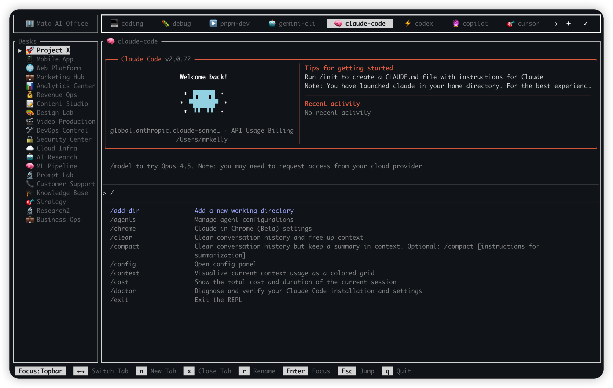
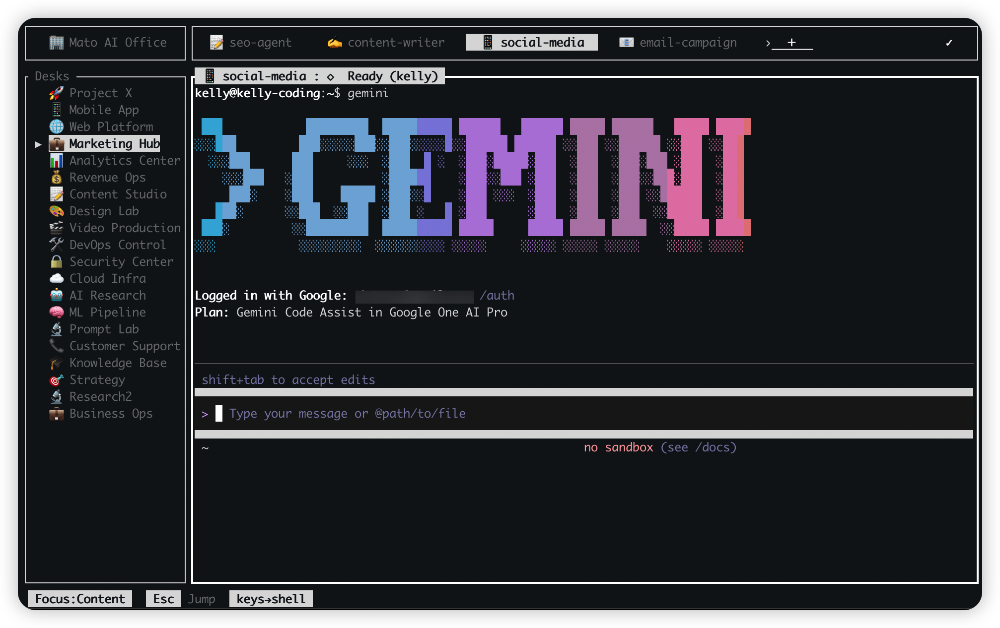
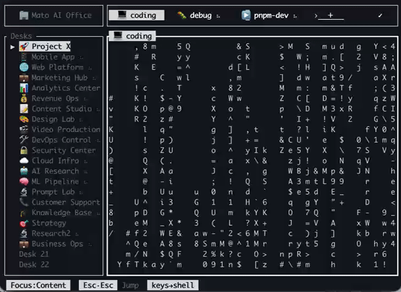
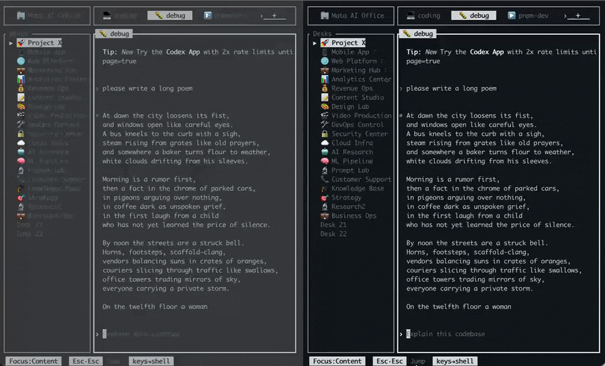
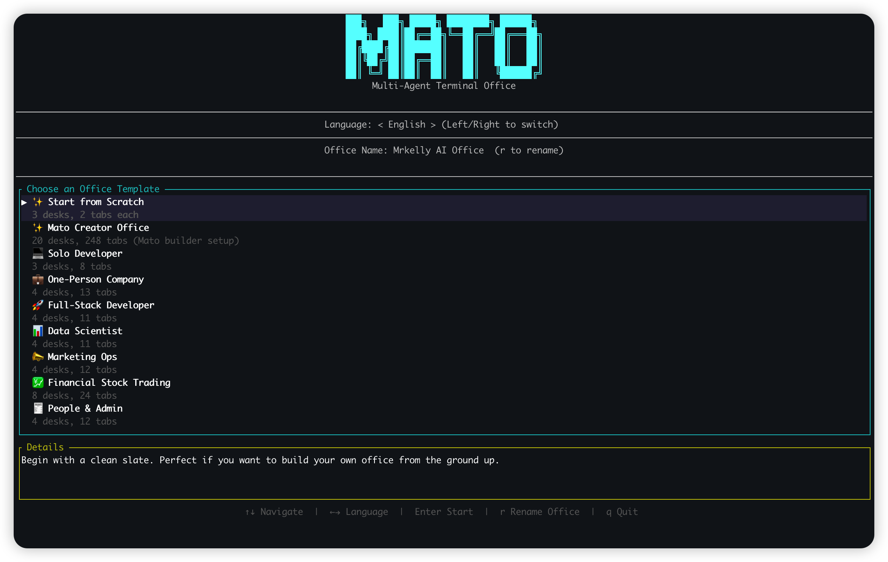
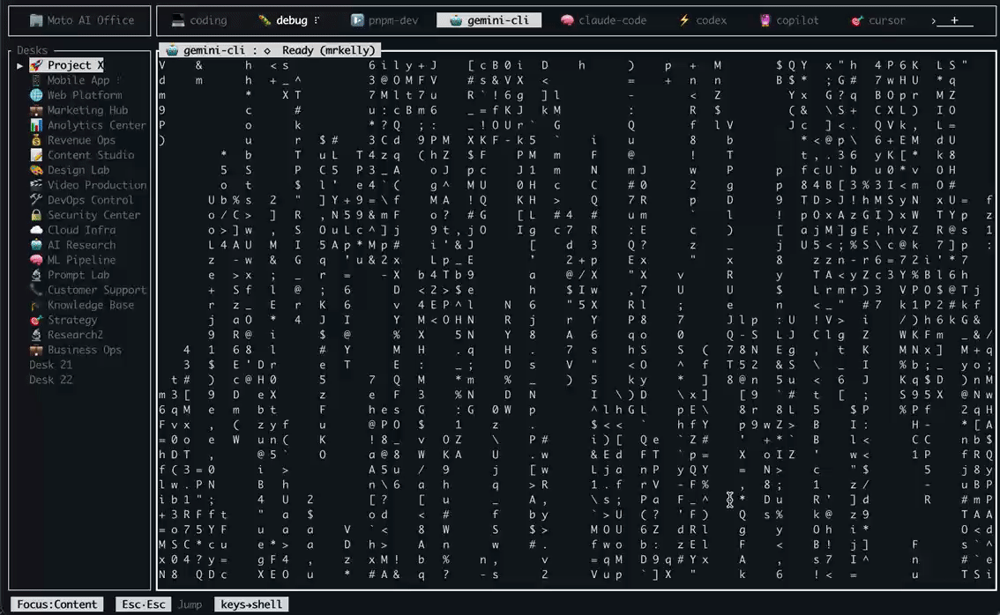
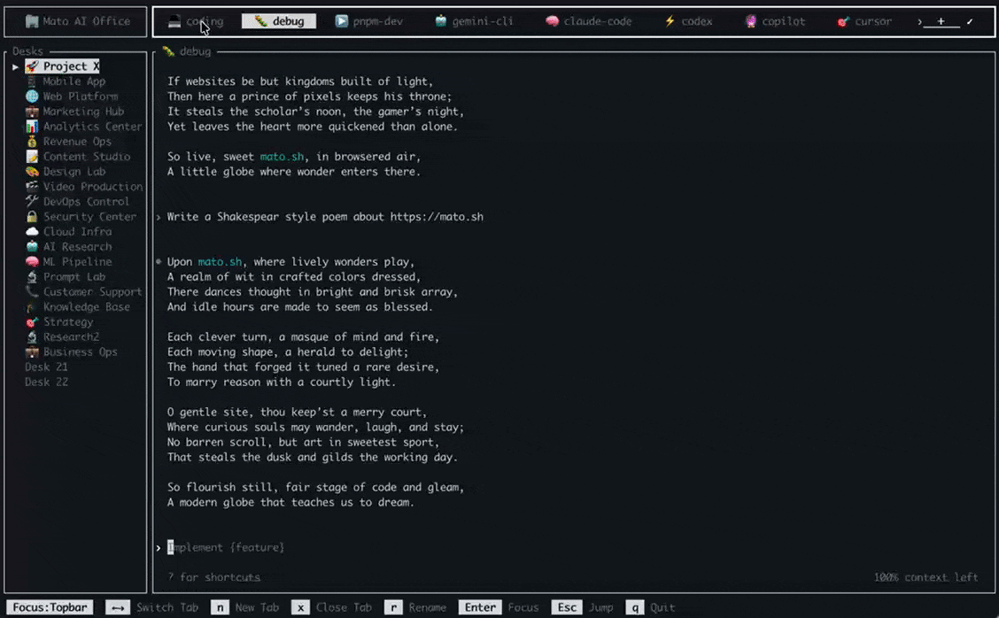
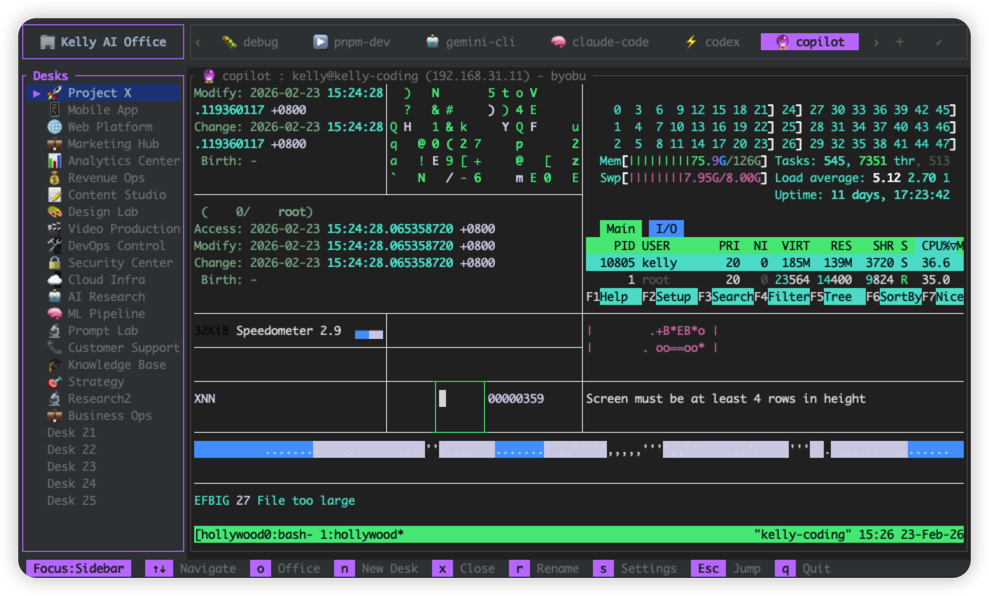

<div align="center">


# Mato

### 🏖️ The Multi-Agent Terminal Office
**Managing hundreds of AI agents from your terminal.**

English: MAY-to, Spanish: undefined  
粤语: 咩圖, 한국어: 메이토, 日本語: メイト 

[](https://www.rust-lang.org/)
[](LICENSE)
[](https://github.com/mr-kelly/mato/releases/latest)
[](https://github.com/mr-kelly/mato/stargazers)

[**Quick Start**](#-get-started-in-60s) • [**Features**](#-features) • [**Why Mato?**](#-the-vision) • [**Development**](#-development-with-coding-agents) • [**Resources**](#-resources)



---

**Mato** is a terminal multiplexer and workspace that brings visual intelligence to the CLI.

It turns your terminal into an "Office" with Desks and Tabs, where you can monitor parallel tasks, manage complex agent swarms, and keep long-lived background sessions organized — all without keyboard conflicts.

</div>

---

## 🚀 Get Started in 60s

### 1. Install Manually
```bash
# Quick Install (Linux/macOS)
curl -fsSL http://mato.sh/install.sh | bash
```

```bash
# Homebrew (Linux/macOS)
brew tap mr-kelly/tap
brew install mato
```

```bash
# Manual Installation
tar xzf mato-*.tar.gz
sudo mv mato /usr/local/bin/
```

### 2. Install with an AI Agent

Copy this prompt into **Claude Code / Codex / Warp / Cursor / Antigravity / OpenClaw / GitHub Copilot (VS Code) / Gemini CLI / Windsurf**:

```text
Install Mato on this machine and verify it works.

1) Run: curl -fsSL http://mato.sh/install.sh | bash
2) If it fails, fallback to Homebrew:
   - brew tap mr-kelly/tap
   - brew install mato
3) Verify with:
   - mato --version
   - start mato once, then exit
4) If all install paths fail, continue with GitHub release binary, then source build.
```

### 3. Launch your first Office
```bash
mato
```
Select a template (we recommend **Full-Stack** for your first run) and start coding.

### 4. Mastering the Flow
*   **`Esc`**: Enter Jump Mode (Teleport anywhere)
*   **`n`**: New Desk/Tab (Context-aware)
*   **`r`**: Rename instantly
*   **`Enter`**: Dive back into the terminal

---

## 👁️ The Vision: Visual Intelligence for CLI

Traditional terminal multiplexers (tmux/screen) are "blind." You never know what's happening in another tab until you switch to it. **Mato changes that.**

| **The Problem** | **The Mato Solution** |
| :--- | :--- |
| 🕵️ **Lost in Tabs** | **Real-time Activity Spinners** notify you exactly where the work is happening. |
| ⌨️ **Shortcut Hell** | **Zero-Conflict Design**: Your shell belongs to you. Only `Esc` is special. |
| 📉 **Task Anxiety** | **Visual Breadcrumbs**: Instant status of every background agent or build process. |
| 🔌 **Session Loss** | **Daemon-First Architecture**: Your workspace lives even if the client dies. |

---

## ✨ Features

<table border="0">
<tr>
<td width="50%" valign="top">



**1) Offices -> Desks -> Tabs UI**

A structured workspace hierarchy where Offices contain multiple Desks, and each Desk contains Tabs for parallel terminal workflows.

</td>
<td width="50%" valign="top">



**2) Spinner Activity (AI is working)**

Live spinner indicators appear on active tabs/desks when an AI agent or process produces output, so you can track long-running work at a glance.

</td>
</tr>
<tr>
<td width="50%" valign="top">



**3) Multi-Client Sync**

Two SSH clients attach to the same running Mato daemon and view the same workspace state in sync.

</td>
<td width="50%" valign="top">



**4) Prebuilt Templates**

Fast onboarding with prebuilt templates for different workflows:
- **Mato Creator Office**: 20 desks / 248 tabs for complex swarms.
- **Full-Stack**: Frontend, Backend, and DB in one view.
- **Solo Dev**: Focused, minimalist productivity.

</td>
</tr>
<tr>
<td width="50%" valign="top">



**5) Background Runtime Persistence**

AI agents keep running in the background even if your terminal process exits or SSH disconnects; when you open `mato` again, you return to the same live workspace automatically (no explicit detach/attach workflow).

</td>
<td width="50%" valign="top">



**6) Mouse Support in a TUI**

Native mouse interaction for clicking tabs and desks; terminal-first UX with practical GUI-like navigation support.

</td>
</tr>
<tr>
<td width="50%" valign="top">


**7) Jump Mode (Core Navigation)**

Press `Esc` to enter Jump Mode, then jump instantly to visible sidebar/topbar targets without repetitive arrow-key movement.

</td>
<td width="50%" valign="top">



**8) Customizable Themes**

Customize theme colors and visual styles, while keeping Office/Desk/Tab workspace state persistent across reconnects and restarts.

</td>
</tr>
</table>

---

## ⌨️ Shortcut Philosophy

Mato follows the **"Rule of One"**: you don't need to memorize shortcuts. `Esc` is the only state-switch key, and everything else stays with your shell.
By default, Mato does not intercept your normal `Ctrl-*` and `Alt-*` shell/editor shortcuts.

| Key | Action | Context |
| :--- | :--- | :--- |
| **`Esc`** | **Switch State (Jump / Back)** | Global |
| `n` | Create New | Sidebar/Topbar |
| `x` | Close / Terminate | Sidebar/Topbar |
| `r` | Rename | Sidebar/Topbar |
| `o` | Office Selector | Sidebar |
| `q` | Soft Quit | Sidebar |

---

## 👩‍💻 Development with Coding Agents

If you want to improve a feature, fix a bug, or change behavior you are not satisfied with, paste the prompt below into your coding agent and let it implement the change for you.

Recommended agents: **Claude Code / Codex / Warp / Cursor / Antigravity / OpenClaw / GitHub Copilot (VS Code) / Gemini CLI / Windsurf**.

### Fast Contribute (3 steps)

1. Clone and create a branch:
```bash
git clone https://github.com/mr-kelly/mato.git
cd mato
git switch -c feat/your-change
```
2. Make changes and validate:
```bash
cargo build
cargo test
```
3. Commit with Conventional Commits, push, and open a PR to `mr-kelly/mato`.

```text
GitHub project: https://github.com/mr-kelly/mato

I want to contribute a change to Mato:
[Describe your bug report or feature request in detail]

Please do the following:
1) Clone the repository and create a feature branch from latest develop (use the project’s current contribution flow).
2) Read AGENTS.md and CHANGELOG-related docs first, then reproduce the issue (or clarify expected behavior for the feature).
3) Implement a minimal, production-safe fix.
4) Run checks and tests:
   - cargo build
   - cargo test
5) Update docs affected by this change, following AGENTS.md documentation standards (including changelog/release-notes conventions where applicable).
6) Create commit(s) using Conventional Commits format (e.g., fix:, feat:, docs:, refactor:).
7) Push the branch and open a Pull Request to the original Mato repository.
8) In the PR description, clearly explain:
   - root cause summary
   - files changed
   - test/check results
   - what changed and why
   - changelog/docs updates completed
9) Do NOT create a GitHub Issue for this task.
```

Tip: the better your `[Describe ...]` section (expected behavior, actual behavior, logs, screenshots), the better and faster the result.

---

### 🍅 Pronunciation

You say tomato, I say Mato.

- English: MAY-to  
- 粤语: 咩圖  
- 普通话: 番茄终端 
- 日本語: メイト  
- 한국어: 메이토  
- Spanish: `...maybe don't translate this one.`

---

## 🛠️ Resources

<table border="0">
<tr>
<td>

#### 📖 Documentation
- [**Keyboard Shortcuts**](docs/KEYBOARD_SHORTCUTS.md)
- [**AI Agent Guide**](docs/AI_AGENT_FRIENDLY.md)
- [**Persistence Specs**](docs/TERMINAL_PERSISTENCE.md)
- [**Spinner Logic**](docs/SPINNER_LOGIC.md)

</td>
<td>

#### 🔧 Customization
- [**Theme Engine**](docs/changelog/2026-02-22_themes-settings-update-check.md)
- [**Template Gallery**](templates/README.md)
- [**Configuration API**](src/config.rs)

</td>
</tr>
</table>

---

<div align="center">

### Built for the future of development.
Join the **Mato** community and stop hunting for active terminals.

[**Star this project**](https://github.com/mr-kelly/mato) • [**Report a Bug / Request a Feature**](https://github.com/mr-kelly/mato/issues) • [**Follow Roadmap**](docs/todos/roadmap.md)

**Made with 🏖️ for developers who value clarity.**

</div>
