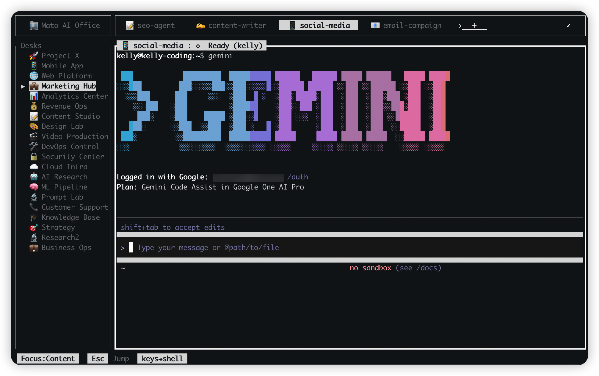

<div align="center">


# Mato

### 🏖️ The Multi-Agent Terminal Office
**Elevate your terminal workflow with real-time activity intelligence.**

English: MAH-toh /ˈmɑːtoʊ/, 普通话: 吗头（mǎ tóu）, 粤语: 嗎桃（maa1 tou4）, 한국어: 마토（ma-to）, 日本語: マト（mato）

[](https://www.rust-lang.org/)
[](LICENSE)
[](https://github.com/mr-kelly/mato/releases/latest)
[](https://github.com/mr-kelly/mato/stargazers)

[**Why Mato?**](#-the-vision) • [**Showcase**](#-showcase) • [**Quick Start**](#-get-started-in-60s) • [**Documentation**](#-pro-resources)


<p align="center"><i>Desk + tab workspace with jump mode and activity-aware terminal layout.</i></p>

---

**Mato** is a high-performance terminal multiplexer and workspace designed for the era of AI agents. It transforms your CLI into a powerful "Office" where you can monitor parallel tasks, manage complex agent swarms, and maintain persistent sessions—all with zero keyboard conflicts and a beautiful, modern TUI.

</div>

---

## 👁️ The Vision: Visual Intelligence for CLI

Traditional terminal multiplexers (tmux/screen) are "blind." You never know what's happening in another tab until you switch to it. **Mato changes that.**

| **The Problem** | **The Mato Solution** |
| :--- | :--- |
| 🕵️ **Lost in Tabs** | **Real-time Activity Spinners** notify you exactly where the work is happening. |
| ⌨️ **Shortcut Hell** | **Zero-Conflict Design**: Your shell belongs to you. Only `Esc` is special. |
| 📉 **Task Anxiety** | **Visual Breadcrumbs**: Instant status of every background agent or build process. |
| 🔌 **Session Loss** | **Daemon-First Architecture**: Your workspace lives even if the client dies. |

---

## ✨ Premium Features

<table border="0">
<tr>
<td width="50%" valign="top">

### 🎯 Live Activity Monitoring
Never poll your terminals again. **Mato's signature spinners** appear in your sidebar and topbar the moment a process produces output. Perfect for tracking long-running builds or AI agents.

### 🤖 AI-Agent Native
Built specifically for tools like **Claude Code, Cursor, and Windsurf**. Mato preserves 100% of your shell's keyboard shortcuts, ensuring your agents operate without interference.

</td>
<td width="50%" valign="top">

### ⚡ Jump Mode (EasyMotion)
Navigate like a pro. Hit `Esc` and use **EasyMotion-style jump labels** to teleport to any desk or tab instantly. No more repetitive arrow-key mashing.

### 🍱 Office Templates
Start with the perfect setup. Choose from 6 curated templates:
- **Mato Creator Office**: 20 desks / 248 tabs for complex swarms.
- **Full-Stack**: Frontend, Backend, and DB in one view.
- **Solo Dev**: Focused, minimalist productivity.

</td>
</tr>
</table>

---

## 📽️ Showcase

> [!TIP]
> **Experience the Flow**: Watch how Mato's activity indicators eliminate the need for constant tab-switching during a complex multi-agent development session.

---

## 🚀 Get Started in 60s

### 1. Installation
```bash
# Quick Install (Linux/macOS)
curl -fsSL https://raw.githubusercontent.com/mr-kelly/mato/main/install.sh | bash
```

```bash
# Homebrew (macOS/Linux)
brew tap mr-kelly/tap
brew install mato
```

```bash
# Manual Installation
tar xzf mato-*.tar.gz
sudo mv mato /usr/local/bin/
```

### 2. Launch your first Office
```bash
mato
```
Select a template (we recommend **Full-Stack** for your first run) and start coding.

### 3. Mastering the Flow
*   **`Esc`**: Enter Jump Mode (Teleport anywhere)
*   **`n`**: New Desk/Tab (Context-aware)
*   **`r`**: Rename instantly
*   **`Enter`**: Dive back into the terminal

---

## ⌨️ Shortcut Philosophy

Mato follows the **"Rule of One"**: Only one key (`Esc`) is reserved by the system. Everything else belongs to your shell.

| Key | Action | Context |
| :--- | :--- | :--- |
| **`Esc`** | **Jump / Teleport** | Global |
| `n` | Create New | Sidebar/Topbar |
| `x` | Close / Terminate | Sidebar/Topbar |
| `r` | Rename | Sidebar/Topbar |
| `o` | Office Selector | Sidebar |
| `q` | Soft Quit | Sidebar |

---

## 🛠️ Pro Resources

<table border="0">
<tr>
<td>

#### 📖 Documentation
- [**Keyboard Shortcuts**](docs/KEYBOARD_SHORTCUTS.md)
- [**AI Agent Guide**](docs/AI_AGENT_FRIENDLY.md)
- [**Persistence Specs**](docs/TERMINAL_PERSISTENCE.md)
- [**Spinner Logic**](docs/SPINNER_LOGIC.md)

</td>
<td>

#### 🔧 Customization
- [**Theme Engine**](docs/changelog/2026-02-22_themes-settings-update-check.md)
- [**Template Gallery**](templates/README.md)
- [**Configuration API**](src/config.rs)

</td>
</tr>
</table>

---

<div align="center">

### Built for the future of development.
Join the **Mato** community and stop hunting for active terminals.

[**Star this project**](https://github.com/mr-kelly/mato) • [**Report a Bug**](https://github.com/mr-kelly/mato/issues) • [**Follow Roadmap**](docs/todos/TODO.md)

**Made with 🏖️ for developers who value clarity.**

</div>
